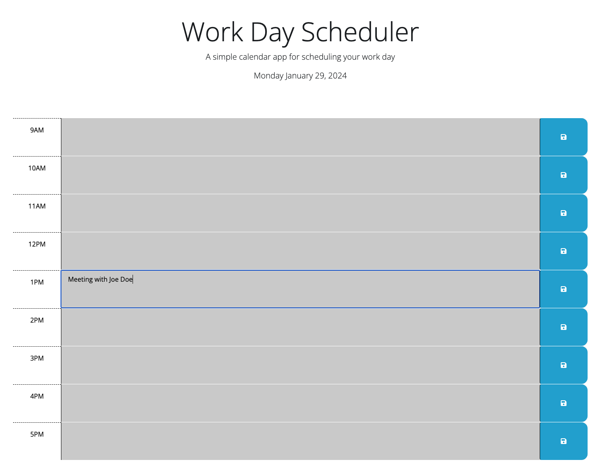

# Legit-daily-planner

Welcome to the Legit Daily Planner

## Features

- **Schedule** Daily planner between office hours
- **Store your events:** You’ll be able store your daily events 

## Getting Started

1. Open the [Legit Daily Planner](https://lage356.github.io/legit-daily-planner/).
2. Click on the text area at desired office hour
3. Click on the save icon at the right 
4. Store your events

## Example

## Technologies Used

- HTML
- CSS
- JavaScript
- DayJS
- jQuery

## Contributing

N/A

## License

This project is licensed under the [MIT License](LICENSE).

## Contact

If you have any questions, feedback, or issues, please reach out to us:

- Email: fernando.lage356@gmail.com
- GitHub: https://github.com/lage356

Thank you for using the legit daily planner! See you next Challenge
